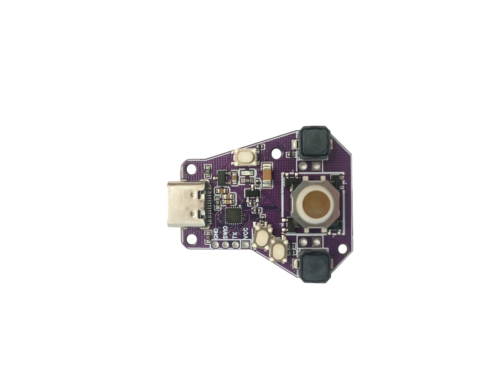

# Demo PikoBall USB HID Trackball

It's a basic example demonstrating how to build a USB HID trackball with smart LED backlight. The example demonstrates usb functionality, trackball handling, WS2812B LEDs and setting save(optiondata/User selected words). Multiple sensitivity settings are implemented, there are also 3 backlight modes: No backlight, white backlight and changing colors. 

If you want to buy your own pre-flashed PikoBall, check out this [Tindie store](https://www.tindie.com/products/allexok/pikoball-tiny-usb-hid-trackball-with-rgb-backlight/), schematics is available from the 'Specs and Docs' tab on Tindie.

