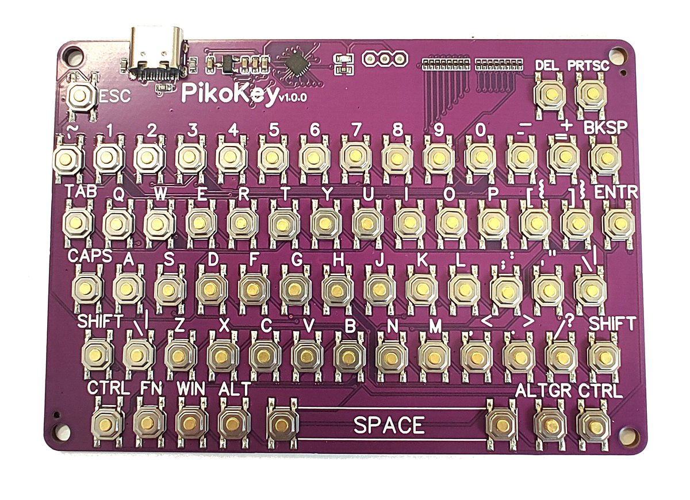

# Demo PikoKey USB HID Keyboard

It's a basic example demonstrating how to build a USB HID keyboard. The example includes both the usb functionality and keyboard matrix handling. Most usefull buttons are implemented including shift,ctrl and so on. Fn button allows adding additional buttons.(Implemented: w,a,s,d ->  ↑, ←, ↓,→  or 1,2,3...->F1,F2,F3...)

If you want to buy your own pre-flashed PikoKey, check out my [Tindie store](https://www.tindie.com/products/allexok/pikokey-mini-hid-usb-mechanical-keyboard/), schematics is available from the 'Specs and Docs' tab on Tindie.

