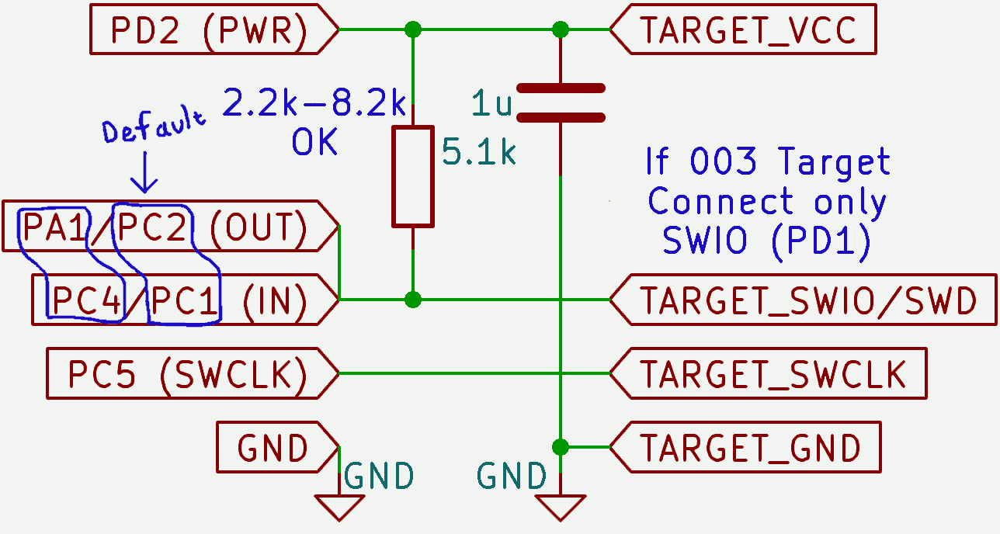

# ch32v003 programmer for WCH V- and X- chips

While this is in `master`, it should still be considered somewhat experimental.  It may make sense to instead of use two pins, use two timers on a single pin.

This is still a bit of an RFC and should not be considered the "real path" moving forward.

## A minichlink-compatible programmer

Simply use a CH32V003, connected as follows:

And you can program, semihost and run basic GDB on a variety of WCH chips including the CH32V003, 20x, 30x and x03x.

It's actually only a little slower than the normal programmer somehow, in spite of bit banging USB?
